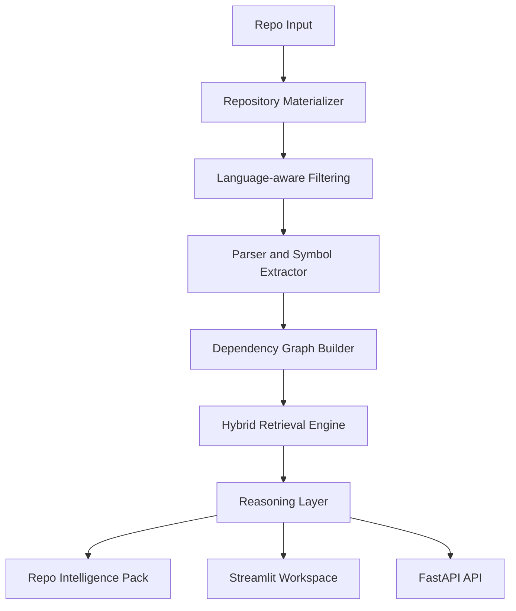

# summarisegit

`summarisegit` is a repo-to-Claude context compiler and code intelligence workstation for unfamiliar repositories. It parses repositories structurally, builds dependency graphs, generates impact analysis, and exports compact context packs that are actually usable in Claude/GPT instead of dumping the whole repo.

[](https://share.streamlit.io/)

## Live Demo

- Streamlit app entrypoint: `streamlit_app.py`
- FastAPI app entrypoint: `app/main.py`
- Public Streamlit URL: deploy this repo on Streamlit Community Cloud and select `streamlit_app.py`
- Local Streamlit run: `streamlit run streamlit_app.py`

## API Usage

This project currently uses **no paid external API**.

The current engine is built on:
- Python AST parsing
- JavaScript/TypeScript structural parsing
- TF-IDF retrieval with `scikit-learn`
- graph traversal for impact and dependency analysis
- `git clone` for public GitHub repository ingestion

That means there is **no OpenAI, Anthropic, Groq, or paid vector database dependency** required to run the current version.

## What It Does

- repo ingestion from local path, GitHub URL, or zip upload
- branch-aware analysis with extension and directory filtering
- file-level and function-level structural summaries
- file dependency graph and function call graph
- impact analysis with affected files, dependents, and suggested tests
- Ask Repo mode for architecture and code flow questions
- Repo Intelligence Pack exports for Claude, interviews, architecture handoff, and PR review
- improvement engine for code smells, large files, missing tests, risky dependencies, security smells, and architecture bottlenecks

## Repo Intelligence Pack

One-click export generates:

- `repo_context.md`
- `architecture.md`
- `function_map.md`
- `improvement_plan.md`
- `architecture_diagram.mmd`
- `dependency_graph.json`

## Block Architecture



## System Flow

```text
User Input
   ↓
Repository Materializer (local path / GitHub clone / zip upload)
   ↓
Language-aware filtering
   ↓
Parser + Symbol Extractor
   ↓
Dependency Graph Builder
   ↓
Hybrid Retrieval (TF-IDF + keyword + graph context)
   ↓
Reasoning Layer (impact, flow, architecture, improvements, diff review)
   ↓
Repo Intelligence Pack + Streamlit Workspace + FastAPI API
```

## Streamlit Deployment

To deploy on Streamlit Community Cloud:

1. Push this repo to GitHub
2. Go to `share.streamlit.io`
3. Click **Create app**
4. Select this repository
5. Set the entrypoint file to `streamlit_app.py`
6. Deploy

## FastAPI API Surface

- `POST /api/analyze`
- `GET /api/reports/{report_id}`
- `GET /api/reports/{report_id}/graph?kind=file|symbol`
- `GET /api/reports/{report_id}/impact?target=...`
- `GET /api/reports/{report_id}/flow?target=...`
- `GET /api/reports/{report_id}/search?q=...`
- `POST /api/reports/{report_id}/ask`
- `POST /api/reports/{report_id}/export`
- `GET /api/reports/{report_id}/explain?mode=architecture|newcomer|file|symbol|refactor|dead-code|improvements`
- `GET /api/reports/{report_id}/source?path=...`
- `POST /api/reports/{report_id}/review-diff`

## Run Locally

### Streamlit

```bash
python3 -m venv .venv
source .venv/bin/activate
pip install -r requirements.txt
streamlit run streamlit_app.py
```

### FastAPI

```bash
uvicorn app.main:app --reload --port 8010
```

## Resume Version

**summarisegit | Streamlit, FastAPI, AST, Dependency Graphs, TF-IDF**

- Built a repo intelligence platform that parses repositories into function-level chunks and dependency graphs for architecture discovery and impact analysis
- Implemented Repo Intelligence Pack exports that compress large codebases into Claude-ready architecture, function map, and improvement artifacts
- Developed hybrid retrieval using TF-IDF, keyword search, and graph context to answer structural questions about unfamiliar repositories
- Added impact analysis, code flow tracing, repo Q&A, and architecture improvement suggestions in both Streamlit and API-driven interfaces
